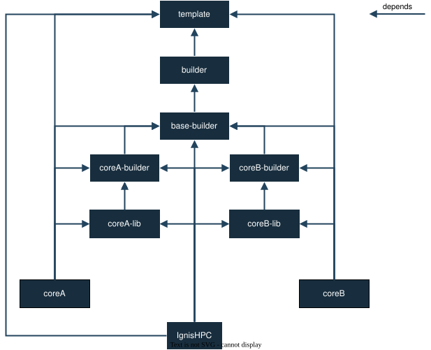

Docker Images
=============

----------
Background
----------

IgnisHPC is fully containerized, and images live in each repository under a standard ``Dockerfiles/`` directory.  
Each subfolder in ``Dockerfiles/`` ending in ``-builder`` or ``-lib`` drives how the client builds both builder and runtime images.  
The client's ``ignishpc images build`` command:

  1. Recursively scans every ``Dockerfiles/`` folder  
  2. Detects subfolders whose names end in ``-builder`` or ``-lib``  
  3. Builds each “builder” image (passing any ``ARG`` values from its Dockerfile)  
  4. For each builder, generates one or more runtime images by copying its ``$IGNIS_HOME`` tree into a base template and running its install script  
  5. Skips any folders labeled with ``LABEL ignis.build="optional"`` unless ``--all`` is specified  

This hierarchy gives each folder name its image tag, and lets you extend IgnisHPC by simply adding new ``Dockerfiles/<module>-builder/`` or ``<module>-lib/`` folders.

-------
Details
-------

Inside each repository's ``Dockerfiles/`` directory, subfolders define separate build targets:

- **Builder folders** (``<module>-builder/``)  
  Each builder folder contains a Dockerfile that:

  1. Uses a base builder template (via a ``FROM`` line, for example ``FROM common-Builder``).  
  2. Compiles the module's source code.  
  3. Places the build artifacts under ``$IGNIS_HOME`` in the image.  
  4. Provides an install script named ``ignis-<module>-install.sh`` in ``$IGNIS_HOME/bin``.

- **Library folders** (``<module>-lib/``, optional)  
  Each library folder's Dockerfile:
  
  1. Starts FROM its corresponding builder image (e.g. ``FROM <module>-builder``).  
  2. Builds any additional libraries or headers.  
  3. Installs them into ``$IGNIS_HOME/lib`` and ``$IGNIS_HOME/include``.  
  4. Includes its own ``ignis-<module>-install.sh`` in ``$IGNIS_HOME/bin``.

- **Other folders**  
  Any other subfolder under ``Dockerfiles/`` follows the same pattern: build from its designated builder, deposit output into ``$IGNIS_HOME``, and include an install script.

Once all builder images are ready, the client creates final runtime images by:

1. Copying the entire ``$IGNIS_HOME`` directory from each builder image into a fresh ``common`` template image.  
2. Running the corresponding ``ignis-<module>-install.sh`` inside that runtime image to install the module.

This structure ensures that adding a new ``<name>-builder/`` or ``<name>-lib/`` folder automatically integrates your custom core or library into IgnisHPC’s image hierarchy.  

Base
^^^^

The **base** image extends an official Ubuntu release (matched to the IgnisHPC version).  
It defines core environment variables and creates the empty ``$IGNIS_HOME`` hierarchy:

- ``bin/``  
- ``core/``  
- ``lib/``  
- ``include/``  
- ``etc/``  
- ``env.d/``

All other images—builders and runtimes—start ``FROM base``.

Builder
^^^^^^^

**Builder** images extend ``base`` to install build tools (GCC, GDB, etc.).  
They are only used during the build stage and are never run for user code.

**common-Builder**
^^^^^^^^^^^^^^^^^^^^^^

Provides system-wide dependencies (e.g. MPI, Thrift) so that individual cores don’t each compile them.

**driver-Builder**
^^^^^^^^^^^^^^^^^^^^^^

Compiles the backend's driver code and installs it into ``$IGNIS_HOME`` along with its dependencies.

**executor-Builder**
^^^^^^^^^^^^^^^^^^^^^^

Compiles executor-side components and prepares an install script in ``$IGNIS_HOME/bin``.

common
^^^^^^

The **common** runtime template extends ``base`` and carries:

- Build outputs from ``driver-Builder`` and ``executor-Builder`` (but does not install them until the install script runs)  
- Empty ``$IGNIS_HOME`` subfolders ready to receive core and library artifacts

core-builder
^^^^^^^^^^^^

Each language **core** (e.g. Python, C++, Go) provides its own ``<core>-builder/`` folder:

- Builds core sources  
- Generates ``ignis-<core>-install.sh`` in ``$IGNIS_HOME/bin``  
- The folder name (e.g. ``python-builder``) becomes the image tag

core images
^^^^^^^^^^^

For each core-builder, three runtime images are automatically generated:

1. ``<core>-driver``   - installs only the driver components  
2. ``<core>-executor`` - installs only the executor components  
3. ``<core>``           - installs both driver and executor components

All are built ``FROM`` the ``common`` template by running the corresponding install scripts.

core helper images
^^^^^^^^^^^^^^^^^^

Any ``<core>-lib/`` or other helper folder under ``Dockerfiles/`` produces:

- A library runtime image that installs into ``$IGNIS_HOME/lib`` and ``$IGNIS_HOME/include``

full
^^^^

A ``full`` runtime image includes both driver and executor for all cores:

- Built automatically after individual core images  
- Tagged ``ignishpc/full`` by default

submitter
^^^^^^^^^

The ``submitter`` image bundles the job-submission CLI (``ignishpc run``) and its dependencies:

- Compiled in the ``driver-Builder`` stage  
- Stored in the backend repository  

It is used under the hood by ``ignishpc run`` when Docker is the scheduler.
